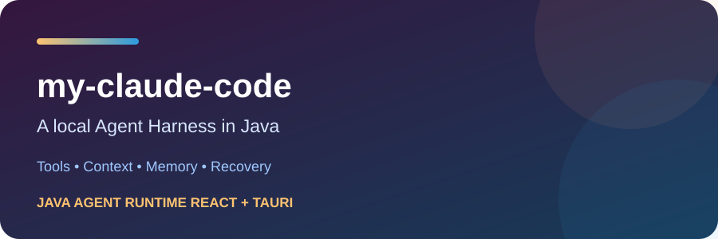
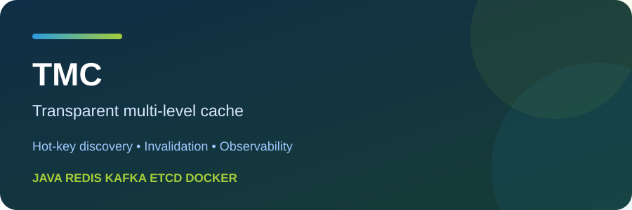
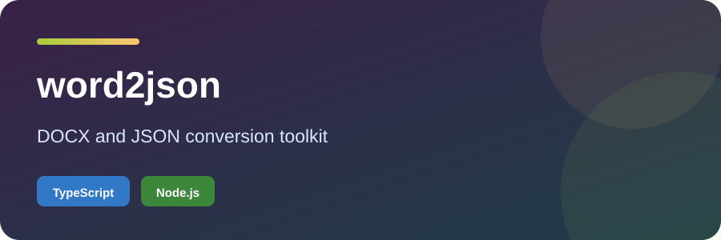

  

  <h1>👋 Hi, I'm codingayice</h1>

  

  

    
    
  

<h2 align="center">
  
  A small corner of the open-source world
</h2>

I like making things that are useful, understandable, and worth sharing.

This page is a collection of projects, experiments, and ongoing explorations.

<h2 align="center">
  
  What I'm exploring
</h2>

<table border="0" cellspacing="0" cellpadding="0" width="100%">
  <tr>
    <td width="33%" valign="top" align="center">
      <h3>🧩 Tools</h3>
      
Small tools that make everyday development, learning, and problem-solving a little easier.

    </td>
    <td width="33%" valign="top" align="center">
      <h3>🧠 Systems</h3>
      
The ideas behind reliable software: state, boundaries, persistence, communication, and recovery.

    </td>
    <td width="33%" valign="top" align="center">
      <h3>🔬 Experiments</h3>
      
Experiments at the intersection of code, automation, and intelligent software.

    </td>
  </tr>
</table>

<h2 align="center">
  
  Skills &amp; Tools
</h2>

  

    

  
  
  

  

<h2 align="center">
  
  Selected Projects
</h2>

  
  

  
  

  

<h2 align="center">
  
  GitHub at a Glance
</h2>

  
  
  

  Languages and tools are shown above; project cards link directly to their repositories.

<h2 align="center">
  
  Contributions
  
</h2>

  <picture>
    <source media="(prefers-color-scheme: dark)" srcset="https://raw.githubusercontent.com/codingayice/codingayice/output/github-contribution-grid-snake-dark.svg" />
    <source media="(prefers-color-scheme: light)" srcset="https://raw.githubusercontent.com/codingayice/codingayice/output/github-contribution-grid-snake.svg" />
    
  </picture>

  

  模板设计灵感来源：© Zephyr Zhong (<a href="https://github.com/zyh3699">https://github.com/zyh3699</a>)

